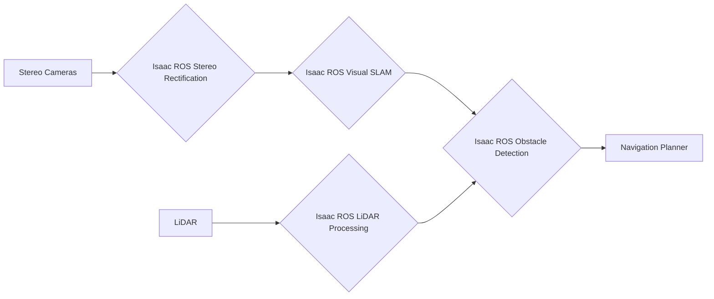

# Chapter 2: Isaac ROS: Accelerated Perception & VSLAM

## Learning Objectives

After completing this chapter, you will be able to:
- Understand Visual SLAM fundamentals in the context of Isaac ROS
- Explain hardware acceleration concepts with Isaac ROS
- Implement Isaac ROS Perception Pipeline components
- Describe GPU-accelerated processing techniques for perception tasks
- Apply Isaac ROS packages for Visual SLAM and Apriltag detection

## Visual SLAM Fundamentals in Isaac ROS

Visual Simultaneous Localization and Mapping (VSLAM) is a critical capability for autonomous robots, enabling them to understand their position in an environment while simultaneously building a map of that environment using visual sensors. Isaac ROS provides optimized implementations of VSLAM algorithms that leverage NVIDIA's hardware acceleration capabilities.

### Core Components of VSLAM

Visual SLAM systems typically involve several interconnected components:

1. **Feature Detection and Matching**: Identifying distinctive visual features in the environment and tracking them across consecutive frames
2. **Pose Estimation**: Computing the camera's position and orientation relative to the environment
3. **Bundle Adjustment**: Optimizing 3D structure and camera poses based on observations
4. **Loop Closure**: Detecting when the robot revisits previously mapped areas to correct drift
5. **Map Maintenance**: Managing the map's scale, consistency, and memory usage

### Isaac ROS VSLAM Architecture

Isaac ROS implements VSLAM through a collection of optimized packages that leverage CUDA and TensorRT for hardware acceleration:

- **Isaac ROS Visual SLAM (NVDSLAM)**: NVIDIA's deep-learning enhanced SLAM approach
- **Isaac ROS AprilTag**: High-precision fiducial marker tracking
- **Isaac ROS Stereo Dense Reconstruction**: 3D scene reconstruction capabilities
- **Isaac ROS ISAAC Manipulator**: Tools for robot manipulator tasks

## Hardware Acceleration Concepts in Isaac ROS

One of the key advantages of Isaac ROS is its integration with NVIDIA's GPU acceleration technologies, which significantly improves the performance of computationally intensive perception tasks.

### CUDA Acceleration

CUDA enables direct utilization of NVIDIA GPU cores for general-purpose computing. Isaac ROS packages utilize CUDA kernels for:
- Image processing operations
- Matrix computations for pose estimation
- Deep learning inference for object detection
- Point cloud processing

### TensorRT Optimization

TensorRT is NVIDIA's inference optimizer that provides:
- Model quantization for faster execution
- Layer fusion to reduce memory transfers
- Custom kernel optimization for specific network architectures
- Dynamic batching for variable input sizes

### Hardware Considerations

Isaac ROS packages are designed to work efficiently on NVIDIA Jetson platforms and discrete GPUs, taking advantage of:
- Dedicated Tensor Cores for mixed-precision operations
- Optimized memory hierarchy (HBM, shared memory)
- High-bandwidth memory access patterns
- Parallel execution of multiple perception tasks

## Isaac ROS Perception Pipeline

The Isaac ROS Perception Pipeline consists of several interconnected components that process raw sensor data and transform it into meaningful environmental understanding.

### Core Pipeline Components

1. **Image Acquisition**: Capturing synchronized images from stereo cameras or multiple sensors
2. **Preprocessing**: Rectification, normalization, and format conversion
3. **Feature Extraction**: Identification of visual features using accelerated algorithms
4. **Tracking**: Associating features across consecutive frames
5. **Optimization**: Bundle adjustment and pose refinement
6. **Output**: Trajectory, map, and intermediate processing results

### Integration with Other ROS Systems

Isaac ROS perception components integrate seamlessly with standard ROS 2 systems:
- Standard sensor_msgs for image and point cloud data exchange
- tf2 for coordinate transformation management
- ROS 2 parameters for runtime configuration
- Standard topics and services for communication

## GPU-Accelerated Processing Techniques

Isaac ROS employs several techniques to maximize GPU utilization for perception tasks:

### Parallel Processing Pipelines

Different stages of perception can run in parallel:
- While one frame is being processed by the SLAM algorithm, another can be undergoing deep learning inference
- Multiple cameras or sensors can share the same GPU resources through proper scheduling

### Memory Management

Efficient GPU memory management is critical:
- Pinned host memory for faster GPU transfers
- Memory pooling to reduce allocation overhead
- Zero-copy memory sharing between CUDA kernels and OpenGL contexts

### Mixed-Precision Processing

Tensor Cores enable significant speedups through mixed-precision computation:
- Maintaining accuracy for critical operations in FP32
- Accelerating matrix operations in FP16 or INT8
- Careful numerical analysis to ensure stability

## Practical Examples of Isaac ROS Packages

### Visual SLAM Implementation

Isaac ROS Visual SLAM package combines traditional geometric methods with deep learning enhancement:

```yaml
# Example configuration for NVDSLAM
nvds_slam_node:
  ros__parameters:
    camera_type: "stereo"
    image_width: 1920
    image_height: 1080
    gpu_id: 0
    enable_rectification: true
    publish_pose_graph: true
    enable_localization: true
```

### AprilTag Detection

AprilTag detection provides high-precision fiducial marker tracking:

```cpp
#include "isaac_ros_apriltag_interfaces/msg/april_tag_detection_array.hpp"

// Isaac ROS AprilTag node automatically detects and tracks AprilTag markers
// with millimeter-level pose accuracy
```

## Real-World Isaac ROS Applications

### Autonomous Mobile Manipulation

In a typical mobile manipulation scenario using Isaac ROS packages:

1. **Perception Pipeline**: RGB-D sensors feed into Isaac ROS stereo dense reconstruction
2. **SLAM Integration**: Visual SLAM maintains a consistent map of the environment
3. **Object Detection**: Isaac ROS detection networks identify objects of interest
4. **Planning**: Navigation and manipulation planners use the processed information
5. **Execution**: Commands are sent to robot controllers with closed-loop feedback

### Warehouse Automation

For warehouse robot applications:

1. **Scene Understanding**: Isaac ROS segmentation networks identify obstacles and pathways
2. **Localization**: VSLAM maintains precise robot positioning relative to warehouse map
3. **Fiducial Tracking**: AprilTag detection allows precise alignment with inventory stations
4. **Path Planning**: Nav2 integration provides collision-free navigation to waypoints
5. **Grasping**: Isaac ROS manipulation packages enable precise object pickup and placement

### Inspection and Monitoring

For robotic inspection tasks:

1. **Sensor Fusion**: Isaac ROS packages combine data from multiple sensor types
2. **Defect Detection**: Deep learning models running on GPU identify anomalies
3. **Trajectory Optimization**: Predefined paths ensure complete coverage of inspection zones
4. **Data Capture**: High-resolution imagery is processed and stored for review
5. **Reporting**: Automated reports highlight detected issues with precise location data

## Isaac ROS Package Integration Patterns

### Perception Pipeline Integration



### Hardware Acceleration Integration

The following packages provide hardware acceleration for different perception tasks:

- **Isaac ROS Visual SLAM**: Accelerates pose estimation and mapping using GPU
- **Isaac ROS Stereo Dense Reconstruction**: Accelerates 3D reconstruction using CUDA cores
- **Isaac ROS Detection NITROS**: Accelerates object detection using TensorRT
- **Isaac ROS AprilTag**: Accelerates fiducial marker detection and pose estimation
- **Isaac ROS Image Pipeline**: Accelerates preprocessing operations using GPU

### Standard Integration Workflow

1. **Launch Configuration**: Configure Isaac ROS nodes with appropriate parameters
2. **Resource Allocation**: Assign GPU resources to perception nodes
3. **Data Flow Verification**: Verify sensor data flows through pipeline correctly
4. **Performance Tuning**: Optimize parameters for target frame rates
5. **Integration Testing**: Validate complete pipeline with robot system

## Summary

Isaac ROS provides a comprehensive suite of hardware-accelerated perception tools that enable efficient and high-performance visual SLAM implementations. Through CUDA and TensorRT optimization, these packages deliver real-time performance for demanding perception tasks on NVIDIA hardware platforms, making them ideal for humanoid robot applications where processing efficiency is paramount.

The standardized ROS 2 interfaces ensure that Isaac ROS perception components can be easily integrated with other ROS packages and custom applications, providing flexibility while maintaining high performance.

## Related Chapters

- [Chapter 1: NVIDIA Isaac Sim & Synthetic Data](./chapter-1-nvidia-isaac-sim.md) - Learn about simulation and synthetic data generation foundations
- [Chapter 3: Nav2 for Humanoid Navigation](./chapter-3-nav2-humanoid-navigation.md) - Explore navigation concepts for humanoid robots